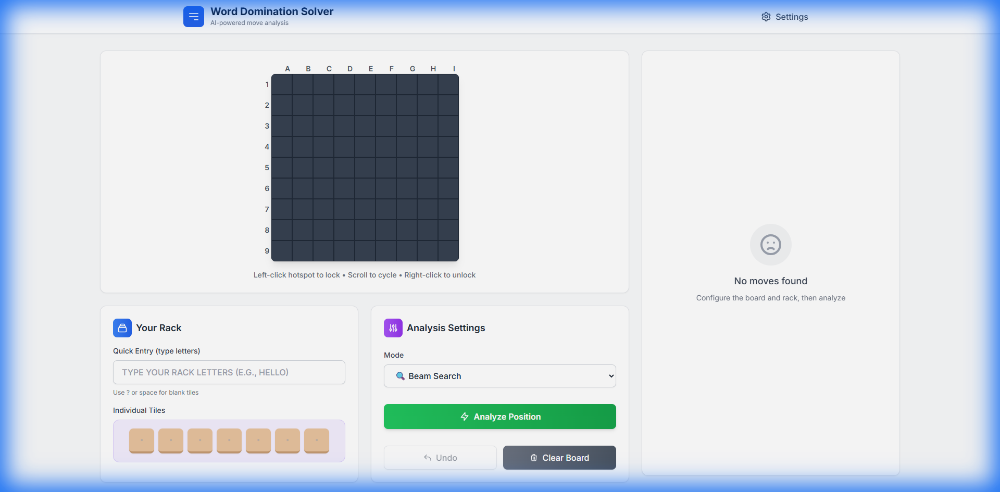

# Word Domination Solver

[](https://github.com/shezmic/Word-Domination-Solver)
[]()
[](LICENSE)

> **A high-performance AI solver for Word Domination featuring an advanced Tactical Board Overlay System for lightning-fast move selection.**



## 🎯 Overview

Word Domination Solver is a cutting-edge analysis tool for the Word Domination game (similar to Scrabble). Built with Rust for maximum performance and React for a modern UI, it features a revolutionary **Tactical Overlay System** that reduces move selection time from 60 seconds to just 3-5 seconds.

**Status**: Production Ready ✅  
**Last Updated**: December 2025

---

## 🆕 Recent Improvements (December 2025)

### Backend Enhancements
- **Optimized Release Builds**: LTO, single codegen unit, and stripped symbols for ~20-30% faster binaries
- **Performance Metrics**: Search results now include `moves_evaluated` count for debugging
- **Improved Error Messages**: More descriptive error context throughout the API
- **Better First Move Generation**: Minimum 2-tile length requirement prevents invalid single-letter moves
- **Comprehensive Documentation**: All core modules now have detailed inline documentation

### Frontend UX Improvements
- **Time Budget Selector**: Choose analysis time (1s, 3s, 5s, or 10s) directly from the UI
- **Tile Count Feedback**: Rack editor shows current tile count (e.g., "5/7 tiles")
- **Keyboard Shortcuts**: Press `Escape` to deselect cells on the board
- **Better Empty States**: Improved guidance when no moves are available

### Code Quality
- **TypeScript Documentation**: Comprehensive JSDoc comments for all frontend types
- **Protocol Documentation**: Full documentation for WebSocket message types
- **Constants Cleanup**: Added `BLANK_TILE` constant for clarity in tile handling

---

## ✨ Key Features

### 🚀 Tactical Board Overlay System
- **Phantom Layer**: Best move automatically appears as gold ghost text after analysis
- **Hotspot Indicators**: Color-coded dots show move positions at a glance
  - 🟡 Gold: Top 3 moves
  - ⚪ Silver: Ranks 4-10
  - 🔵 Blue: Ranks 11-20
- **Cycle-Clicking**: Scroll through multiple moves at the same position
- **Hover Preview**: Instantly see moves without clicking
- **Chess-Style Coordinates**: A-I columns, 1-9 rows for easy position reference

### 🧠 Advanced Solver Engine
- **GADDAG Data Structure**: Lightning-fast word lookup and validation
- **Multiple Analysis Modes**:
  - ⚡ **Greedy**: Fastest, immediate results
  - 🔍 **Beam Search**: Balanced speed and quality
  - 🎯 **Beam + MCTS**: Best quality with strategic look-ahead
- **Smart Move Clustering**: Groups moves by starting position
- **Cross-Check Validation**: Ensures only valid words are generated

### 🎨 Modern UI/UX
- **Interactive Board Editor**: Click to select, type to place tiles
- **Real-Time Analysis**: WebSocket-based instant feedback
- **Dark Mode Support**: Easy on the eyes
- **Responsive Design**: Works on all screen sizes
- **Undo/Redo**: Full history management

---

## 📊 Performance Metrics

| Metric | Value |
|--------|-------|
| Move Generation | < 10ms (typical position) |
| Beam Search (width=50) | < 100ms |
| Full Analysis (Beam+MCTS) | < 500ms |
| Memory Usage | ~50MB (includes GADDAG) |
| Dictionary Size | 270,000+ words |
| **User Decision Time** | **3-5 seconds** (vs 30-60s scrolling) |

> 💡 **New in v0.2.0**: Search results now include `moves_evaluated` count for performance debugging.

---

## 🚦 Quick Start

### Prerequisites

- **Rust** 1.75.0+ ([Install](https://rustup.rs/))
- **Node.js** 18+ ([Install](https://nodejs.org/))
- **npm** or **yarn**

### One-Command Build

```bash
# Windows
.\build_all.bat

# Unix/Mac/Linux
chmod +x build.sh
./build.sh
```

This script will:
1. Compile the GADDAG dictionary
2. Build the frontend
3. Build the backend solver
4. Start the server at `http://localhost:3000`

### Manual Build

```bash
# 1. Compile GADDAG (first time only)
cd tools/gaddag_compiler
cargo run --release ../../dictionary/dictionary.txt ../../dictionary/dictionary.gaddag

# 2. Build frontend
cd ../../frontend
npm install
npm run build

# 3. Copy frontend to solver
cp -r dist ../solver/static

# 4. Run solver
cd ../solver
cargo run --release --bin solver
```

---

## 🎮 How to Use

### Basic Workflow

1. **Enter Rack Letters**: Type your tiles in the "Your Rack" section
2. **Click "Analyze Position"**: Choose your analysis mode
3. **See Results Instantly**:
   - Gold ghost appears showing the best move
   - Colored dots indicate other move positions
4. **Explore Moves**:
   - **Hover** a dot to preview
   - **Left-click** to lock
   - **Scroll** to cycle through moves at that position
   - **Right-click** to unlock
5. **Play Move**: Click "Play Move" when ready

### Tactical Overlay Controls

| Action | Result |
|--------|--------|
| **Hover hotspot** | Preview best move at that position |
| **Left-click hotspot** | Lock to that position |
| **Scroll wheel** | Cycle through moves (when locked) |
| **Right-click hotspot** | Unlock and return to best move |
| **Double-click board** | Clear all ghost overlays |

---

## 🏗️ Project Structure

```
word-domination-solver/
├── solver/                 # Rust backend
│   ├── src/
│   │   ├── main.rs        # Server entry point
│   │   ├── search.rs      # Search algorithms
│   │   ├── movegen.rs     # Move generation
│   │   ├── gaddag.rs      # GADDAG implementation
│   │   └── board.rs       # Board state management
│   └── static/            # Built frontend files
├── frontend/              # React TypeScript frontend
│   ├── src/
│   │   ├── BoardCanvas.tsx   # Tactical overlay system
│   │   ├── MoveList.tsx      # Move results display
│   │   ├── RackEditor.tsx    # Tile rack management
│   │   └── store.ts          # Zustand state management
│   └── package.json
├── protocol/              # Shared protocol definitions
├── dictionary/            # Word lists and GADDAG
└── tools/                 # Build tools
    └── gaddag_compiler/   # Dictionary compiler
```

---

## 🔧 Configuration

### Analysis Modes

Edit `frontend/src/Controls.tsx` to adjust default settings:

```typescript
const [mode, setMode] = useState<string>('beam');  // 'greedy' | 'beam' | 'beamMCTS'
```

### Solver Parameters

Edit `solver/src/search.rs`:

```rust
// Beam search width (higher = better quality, slower)
let width = match config.mode {
    AnalysisMode::Beam { width } => width as usize,  // Default: 50
    // ...
};

// MCTS rollout depth (higher = more strategic, slower)
AnalysisMode::BeamMCTS { rollout_depth, .. } => {
    // Default: 3
}
```

---

## 🌐 WebSocket API

### Client → Server

```typescript
{
  "Analyze": {
    "board_hash": 12345678,
    "rack": [1, 5, 12, 15, 18, 20, 0],  // A, E, L, O, R, T, blank
    "mode": { "type": "beam", "width": 50 },
    "time_budget_ms": 5000,
    "custom_points": [0, 1, 4, 4, ...]  // Optional
  }
}
```

### Server → Client

```typescript
{
  "Result": {
    "moves": [
      {
        "word": "RELATE",
        "score": 24,
        "placements": [[45, 18], [46, 5], ...]  // [position, tile]
      }
    ],
    "confidence": 0.95,
    "compute_time_ms": 87
  }
}
```

---

## 🎨 UI Features

### Board Interaction
- **Click cells** to select and type letters
- **Enter key** to rotate typing direction
- **Backspace/Delete** to remove tiles
- **Arrow keys** for navigation

### Move Visualization
- **Gold ghost tiles**: Currently selected move
- **Beige tiles**: Placed letters on board
- **Hotspot dots**: Available move positions
- **Count badges**: Multiple moves at same position

### Analysis Controls
- **Time Budget Selector**: Choose 1s, 3s, 5s, or 10s analysis time
- **Tile Count Display**: See "X/7 tiles" in rack editor
- **Mode Selector**: Switch between Greedy, Beam, and Beam+MCTS

### Keyboard Shortcuts
- `Enter`: Toggle horizontal/vertical typing
- `Escape`: Deselect current cell
- `Backspace`: Delete and move back
- `Delete`: Delete current cell
- `Arrow keys`: Navigate cells

---

## 📈 Algorithm Details

### GADDAG Structure
- Directed acyclic graph for word lookup
- Supports bidirectional traversal
- ~2-5MB compiled size for 270K words
- O(word length) lookup time

### Beam Search
- Keeps top N candidates at each step
- Balances exploration vs exploitation
- Configurable width (default: 50)

### Monte Carlo Tree Search (MCTS)
- Simulates future game states
- Evaluates strategic value beyond immediate score
- Considers opponent responses
- Rollout depth: 3 moves ahead

---

## 🐛 Troubleshooting

### Server won't start
```bash
# Check if GADDAG exists
ls dictionary/dictionary.gaddag

# Recompile if missing
cd tools/gaddag_compiler
cargo run --release ../../dictionary/dictionary.txt ../../dictionary/dictionary.gaddag
```

### Frontend not loading
```bash
# Rebuild frontend
cd frontend
npm run build

# Copy to solver
cp -r dist ../solver/static
```

### Invalid words generated
```bash
# Rebuild GADDAG with latest dictionary
cd tools/gaddag_compiler
cargo run --release ../../dictionary/dictionary.txt ../../dictionary/dictionary.gaddag
```

---

## 🤝 Contributing

Contributions are welcome! Please:

1. Fork the repository
2. Create a feature branch (`git checkout -b feature/amazing-feature`)
3. Commit your changes (`git commit -m 'Add amazing feature'`)
4. Push to the branch (`git push origin feature/amazing-feature`)
5. Open a Pull Request

---

## 📝 License

MIT License - see [LICENSE](LICENSE) file for details

---

## 🙏 Acknowledgments

- GADDAG algorithm by Steven Gordon
- React and Rust communities
- Word Domination game developers

---

## 📧 Contact

For questions or support, please open an issue on GitHub.

**Built with ❤️ using Rust and React**
